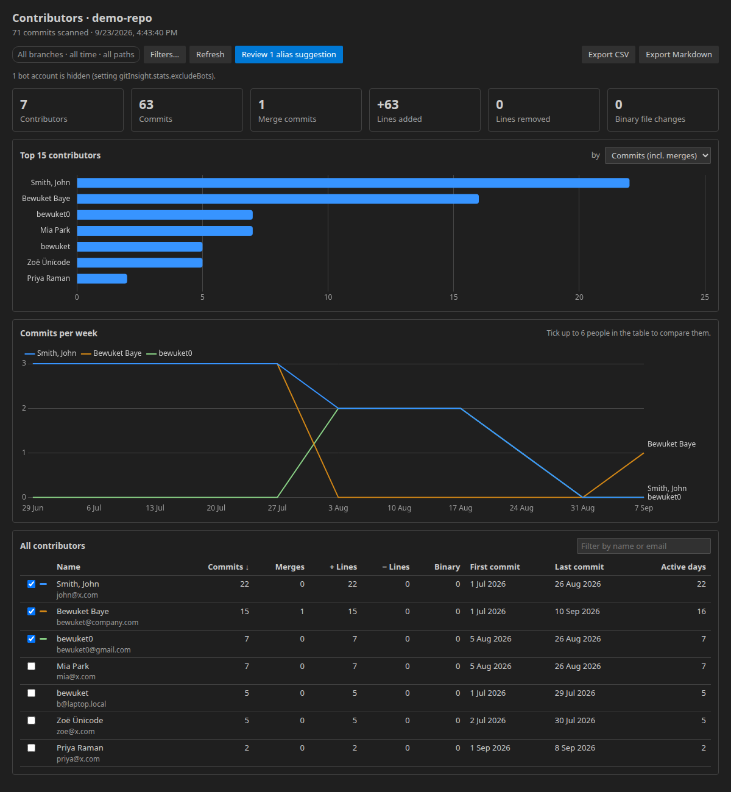

# Git Insight

Git Insight explains the history of a local Git repository and the people behind it. It runs entirely on your machine: no GitHub account, no network access.

> **Status:** Contributor Stats and Who Wrote This? are complete. Date activity, branch comparison and the optional AI explanation are planned (see [CHANGELOG](CHANGELOG.md)).

## Contributor Stats



Open the **Git Insight** view in the activity bar. The sidebar lists the top contributors; click one, or the graph icon, to open the full panel.

For every person, across all branches (`git log --all`):

| Metric | How it is counted |
| --- | --- |
| Commits / merge commits | Counted separately. Non-merge counts match `git shortlog -sn --all --no-merges`. |
| Lines added / removed | From `--numstat`. Merge commits add no lines. Files matching `gitInsight.stats.excludePaths` (lockfiles, `dist/`, `*.min.js` by default) are left out of line counts but not commit counts. |
| Binary files | Binary changes have no line counts, so they are counted separately. |
| First / last commit, active days | Uses the **author date** (it survives rebases). A day is a calendar day in the author's own timezone. |
| Commits per week | Weeks start on Monday; tick up to six people in the table to compare them. |

The table sorts by any column and filters by name or email. **Export CSV** writes a UTF-8 CSV with a BOM and quoted fields, so Excel opens it correctly. **Export Markdown** writes a table you can paste into docs or a pull request.

### Filters

**Filters…** (or the filter icon in the view title) limits stats to:

- a **date range** (`YYYY-MM-DD`, inclusive, compared with the author's local date),
- one **branch, remote branch or tag**, instead of all branches,
- **paths** (comma-separated globs such as `src/**, docs/*.md`).

Filters are remembered per repository.

### One person, many identities

People commit as `bewuket`, `bewuket0` and `Bewuket Baye` from different machines. Git Insight first applies your `.mailmap` (like `git shortlog`), then **suggests** groups it thinks are the same person:

1. the same email address;
2. the same email name (`bewuket@home.com` and `bewuket@work.com`; GitHub `12345+bewuket@users.noreply.github.com` counts as `bewuket`);
3. similar names: after lowercasing and removing accents, digits and punctuation, the names score ≥ 0.9 on Jaro-Winkler similarity, or one name's words are all in the other.

Nothing is merged until you choose. **Review alias suggestions** lets you accept a group, rename it, pick which identities belong together, or reject it. A short name that fits several people (`John` next to `John Smith` and `John Doe`) is listed separately so you can decide.

Decisions are saved in `.gitinsight/aliases.json`, including rejected pairs, which are never suggested again. Commit the file to share it with your team. **Export aliases as .mailmap** appends the confirmed groups to `.mailmap`, so `git log`, `shortlog` and `blame` use them too.

Bot accounts (`dependabot[bot]`, `github-actions`, …) are hidden by default.

## Who wrote this, and when?

Put the cursor in a function, or select some code, then right-click → **Git Insight → Who Wrote This?** The **Code History** view shows every commit that changed that code: subject, author, date and short SHA. The commit that first added it is marked with a star. Click a commit to open a diff of the file before and after it, scrolled to the code. Commits that added a file, and root commits, diff against an empty file.

What "this" means:

| You have… | Git Insight follows… |
| --- | --- |
| The cursor inside a function or method | That function (boundaries from the language server's document symbols) |
| The cursor in a class, outside any method | The whole class |
| A selected identifier, such as `getUser` | Its definition in this file if there is one, otherwise the name |
| Selected lines | Those lines |
| The cursor outside any symbol | The current line |

How the history is found:

1. **Line range** (`git log -L start,end:file`) when the file matches the last commit. The language server knows the function's exact boundaries, so this is the most precise mode.
2. **Function name** (`git log -L :name:file`) when the file has unsaved or uncommitted changes, because editor line numbers may no longer match the committed file. Each mode is the fallback for the other.
3. **Whole file** (`git log --follow`) if neither works, for example when the lines no longer exist. The view says why it fell back.

Line history follows the code across file renames.

A second section lists commits **on any branch** that added or removed the name (`git log -S --all`). This finds where a function first appeared, even if it came from another file or branch. Turn it off with `gitInsight.history.searchAllBranches` on very large repositories.

## Commands

| Command | What it does |
| --- | --- |
| Git Insight: Show Contributor Stats | Opens the stats panel |
| Git Insight: Refresh Contributors | Rescans when history changed (cached otherwise) |
| Git Insight: Set Stats Filters… | Date range, branch/tag, paths |
| Git Insight: Review Alias Suggestions… | Accept, split, rename or reject identity groups |
| Git Insight: Export Aliases as .mailmap… | Writes confirmed groups to a `.mailmap` file |
| Git Insight: Export Stats as CSV… / Markdown… | Saves the current table |
| Git Insight: Who Wrote This? | History of the function or selection under the cursor (also in the editor context menu) |
| Git Insight: Refresh Code History | Runs the last history query again |
| Git Insight: Select Repository | Chooses the repository in a multi-root workspace |
| Git Insight: Clear Cache | Forgets cached scans |

## Settings

| Setting | Default | Description |
| --- | --- | --- |
| `gitInsight.gitPath` | `""` | Path to `git`; empty uses `git` from `PATH` |
| `gitInsight.stats.excludeBots` | `true` | Hide bot accounts |
| `gitInsight.stats.botPatterns` | `\[bot\]`, `^github-actions`, `dependabot`, `renovate`, … | Case-insensitive regexes matched against name and email |
| `gitInsight.stats.excludePaths` | lockfiles, `**/dist/**`, `**/*.min.js`, `**/*.min.css` | Globs left out of line counts |
| `gitInsight.stats.aliasSimilarityThreshold` | `0.9` | Name similarity (0.7–1) needed for a suggestion |
| `gitInsight.stats.treeLimit` | `20` | Contributors listed in the sidebar |
| `gitInsight.history.maxCommits` | `200` | Commits loaded for a code or file history |
| `gitInsight.history.searchAllBranches` | `true` | Also list commits on any branch that added or removed the name |

## Performance and caching

History is streamed from `git log` line by line; nothing large is buffered. On a 10,000-commit repository a first scan takes about half a second, and repeat loads come from the cache in a few milliseconds.

Cached results are keyed by a hash of every ref, `HEAD`, `.mailmap` and your filters. The hash is read straight from `.git`, so checking the cache starts no git process. When a branch moves, the sidebar shows that the stats are out of date. Click **Refresh** to rescan.

Every scan runs with a cancellable progress notification; cancelling kills the git process.

## Limitations

- **Shallow clones** only contain part of the history. Git Insight warns and offers to fetch the rest.
- **Submodules** are not analysed. In a multi-root workspace each folder's repository can be selected.
- `.mailmap` export maps the identities as Git Insight sees them, which is after your existing `.mailmap` has been applied.

## Privacy

All features run locally. Git Insight makes no network requests.

## Development

```sh
npm install
npm run build        # bundle extension + webview (esbuild)
npm test             # unit + integration tests (vitest, needs git)
npm run coverage     # coverage for src/git, src/stats, src/cache
npm run test:e2e -- <path-to-a-repo>   # smoke test inside a real VS Code
```

Press **F5** in VS Code to launch an Extension Development Host.

Layout: `src/git` (git runner and pure parsers), `src/stats` (pure aggregation, aliases, export), `src/services` and `src/views` (VS Code integration), `src/webview` (the panel's browser script; Chart.js is bundled, no CDN).
